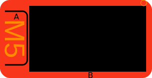

# M5StickCPlus

Programms for M5StickC Plus LCD 240x135
<svg width='312' viewBox='-60,-12 312,160' xmlns='http://www.w3.org/2000/svg' style='background:none;'>
	<rect x='-60' y='-12' width='312' height='160' rx='20' ry='20' fill='#F8361B' />
	<text text-anchor='middle' transform='translate(-50,68) rotate(90)' font-family='Arial' font-size='58' fill='darkorange' >M5</text>
	<path stroke-width='3' stroke='black' fill='none' d='M-50,11 h36a10,10 0 0 1 10,10v90a10,10 0 0 1 -10,10h-36' />
	<rect x='0' y='0' width='240' height='135' fill='black' />
	<g id='Lcd' fill='white' stroke='white' clip-path='url(#lcdclip)' ></g>
	<text x='-32' y= '28' onClick="document.getElementById('Console').innerHTML+='M5.BtnA.wasPressed()\n';">A</text>
	<text x='120' y='148' onClick="document.getElementById('Console').innerHTML+='M5.BtnB.wasPressed()\n';">B</text>
	<circle id='M5_LED' cx='235' cy='-6' r='6' stroke='orange' fill='none' />
</svg>
<textarea id='console'></textarea>
This Programm realizes a SIMPLE Menu for the M5StickC / M5StickC Plus
It allows the User to scroll a long the Options:
<ul>
  <li><b>Rot</b>     Rotate the Display</li>
  <li><b>Covid</b>   Show the actual Values fo Inzidenz and Deaths for GERMANY</li>
  <li><b>Scan</b>   Show the available WiFis</li>
  <li><b>Connect</b> Connect to the WiFis </li>
  <li><b>Clock</b>   Show A Digital Clock from RTC</li>
  <li><b>AClk</b>    Show Analog Clock</li>
  <li><b>BMP</b>     Show an BMP565 Picture</li>
  <li><b>Bat</b>     Show Batterie Status</li>
  <li>..</li>
</ul>
  
  
  
